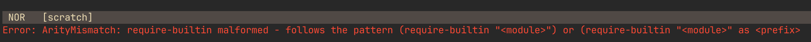

### The Goal

When it's ready, this repo will contain a very simple helix plugin.  The idea is that if you want to play around with writing your own helix plugin, you can clone it and have a (hopefully) sane dev environment while you change the simple plugin into one that you're interested in.

In the future, this will seem like overkill, but since the plugin system is not yet merged in to helix/master, I think there's an opportunity to remove some friction which might otherwise prevent a would-be plugin author from providing feedback on the in-development plugin system.

It uses a nix flake for this.  If that's not your jam, appologies.

### Goodies

- `steel` launches the steel repl
- running `hx` or `hxs` in the project dir configures the steel language server and a scheme formatter (you have to run `nix build` first).
- `hxs` launches [mattwparas:helix/steel-event-system](https://github.com/mattwparas/helix/tree/steel-event-system) ([overrides the theme to `hex_toxic`](init.scm)) to visually distinguish it from `hx`)
- `stemacs` launches emacs configured to work with steel (I'm not an emacs pro, this might be weird)

#### How To

Build the goodies and inject their paths into `.helix/languages.toml`:
```
git clone git@github.com:MatrixManAtYrService/helix-plugin-env.git
cd helix-plugin-env
nix build
```

This populates `./result` which is symlinked from `./helix/`.

```
❯  hx --health scheme
Configured language servers:
  ✓ /nix/store/nlcb3x91044749ilbfymk7bz26jipd3r-steel-interpreter-0.6.0/bin/steel-language-server: /nix/store/nlcb3x91044749ilbfymk7bz26jipd3r-steel-interpreter-0.6.0/bin/steel-language-server
Configured debug adapter: None
Configured formatter: /nix/store/lqw1cz2kg5s0kgglbhikgc8z4ldwn0bp-code-formatter/bin/scheme-format
Binary for formatter: /nix/store/lqw1cz2kg5s0kgglbhikgc8z4ldwn0bp-code-formatter/bin/scheme-format
Highlight queries: ✓
Textobject queries: ✘
Indent queries: ✓
```

To run `hxs` or `steel` enter a dev-shell
```
❯ nix build     # stages the plugin environment
❯ nix develop   # prepares 'steel' and 'hxs'
  $ steel

         _____ __            __
        / ___// /____  ___  / /          Version 0.6.0
        \__ \/ __/ _ \/ _ \/ /           https://github.com/mattwparas/steel
       ___/ / /_/  __/  __/ /            :? for help
      /____/\__/\___/\___/_/

    λ > (display "hello world")
    hello world
    λ >
    CTRL-D
  $ hxs         # helix.scm and init.scm are referenced
  $ exit        # exit the devshell
❯ hxs           # command not found
```

(instead of `nix develop` you can also use [direnv](https://github.com/nix-community/nix-direnv) to activate this automatically when you enter/leave the plugin project dir)

# What's broken

Currently, running `hxs` shows you this error:


I think that's an error in one of the `.scm` files in this repo (I got them from [mattwparas/helix-config](https://github.com/mattwparas/helix-config)), so maybe it's a sign that the environment is correct and the it's the plugin that's broken?
That's progress.

Next: pick just one plugin in the helix-config repo and add it here bit-by-bit.
This will either isolate, or avoid, the error.

# A Note about `STEEL_HOME`

Currently, the devshell in `flake.nix` sets `STEEL_HOME` to `./.steel`.
From there, the `cogs` directory is symlinked to `./result/cogs`.
This means that you must run `nix build` in order for any changes to show up, and if you add any new files, they must be copied by the `helix-config` derivation in `flake.nix`.

This is a somewhat clunky arrangement.
I'll be experimenting later with improvements.


# Contributing

I'm open to different ideas about what an ergonomic helix plugin development workflow might look like.
Feel free to create issues with whatever thoughts you have and we can chat about it.
